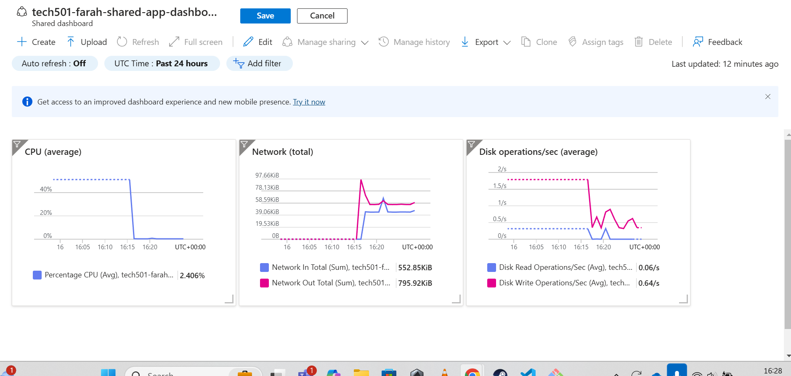
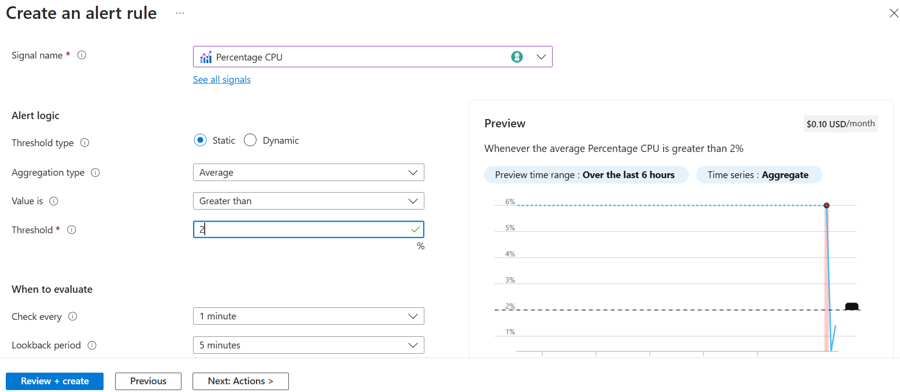
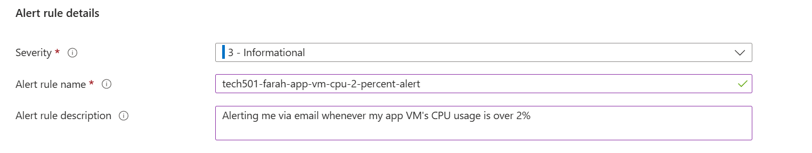
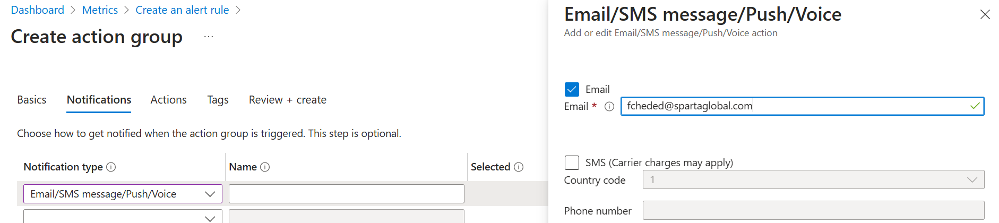
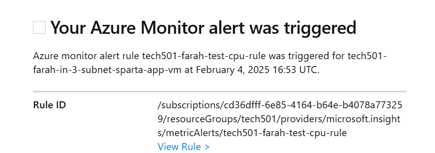
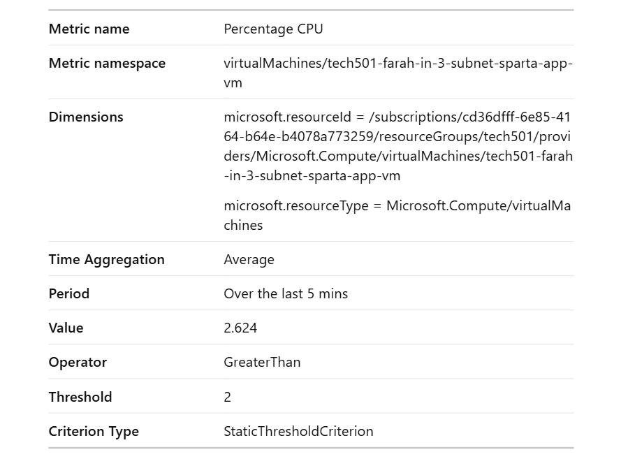
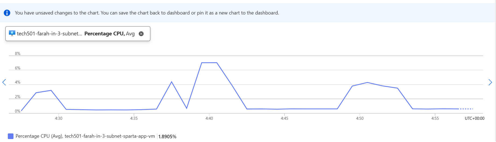

# Azure alerts

- [Azure alerts](#azure-alerts)
  - [Alerts](#alerts)
    - [Setting a 2% CPU alert on our app VM](#setting-a-2-cpu-alert-on-our-app-vm)

## Alerts

- We set alerts because we want our application to be highly reliable and robust
- % of CPU usage is a common metric to base an alert on
- Steps on Azure:
  1. Go to the particular VM's page
  2. Choose **Alerts** under the **Monitoring** tab on the sidebar
  3. Click **Create alert rule**
  4. Define the rule (name, condition, frequency of evaluation)
  5. Assign an action group with an action (e.g. email)

### Setting a 2% CPU alert on our app VM

- This is the dashboard showing CPU metrics **pre-benchmarking**: 

1. **Create the alert**:
    - Set the condition (I've chosen 2% **CPU percentage**, with a **frequency of evaluation** of 1 minute)
    
    

2. Create/assign an **action group** that emails me when the alert rule is triggered:
    

3. Use **ApacheBench** to send requests to the app VM to raise the CPU usage and trigger the rule:
   - `ab -n 1000 -c 100 [public IP of app VM]` 

4. Receive **email notification**:
    

    

- This is the CPU percentage graph **post-benchmarking**:
  
