# CI/CD

- [CI/CD](#cicd)
  - [Note on Week 3 tasks](#note-on-week-3-tasks)
  - [Software development lifecycle (SDLC)](#software-development-lifecycle-sdlc)
    - [Non-DevOps SDLC:](#non-devops-sdlc)
    - [DevOps SDLC:](#devops-sdlc)
  - [CICD pipelines](#cicd-pipelines)
    - [Why build a pipeline?](#why-build-a-pipeline)
  - [CI and its benefits](#ci-and-its-benefits)
  - [CD and its benefits](#cd-and-its-benefits)
  - [The difference between CD and CDE](#the-difference-between-cd-and-cde)
  - [Jenkins](#jenkins)
    - [Why use Jenkins?](#why-use-jenkins)
    - [Disadvantages of Jenkins](#disadvantages-of-jenkins)
    - [Stages of Jenkins](#stages-of-jenkins)
    - [Alternatives to Jenkins](#alternatives-to-jenkins)
  - [Creating our first project in Jenkins](#creating-our-first-project-in-jenkins)
  - [Create a general diagram of CICD](#create-a-general-diagram-of-cicd)
    - [Wednesday afternoon tasks](#wednesday-afternoon-tasks)

## Note on Week 3 tasks

 - We will be using **AWS** and **Jenkins** for these tasks
 - Jenkins Server 1 address: http://34.254.6.118:8080
 - **Jenkins Server 2 address:**  http://52.31.15.176:8080 **(my assigned server)**

## Software development lifecycle (SDLC)

- **High-level SDLC workflow**:
  1. **Plan**
  2. **Design** (i.e. code)
  3. **Develop**
  4. **Deploy**

### Non-DevOps SDLC:

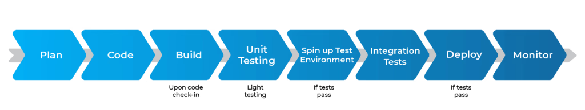

### DevOps SDLC:

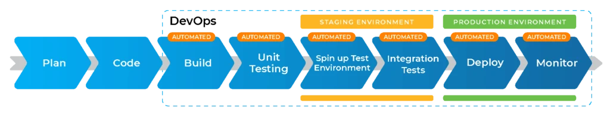

- Remember that the goal of DevOps is to shorten the development lifecycle while maintaining quality and security
- Because the goal is to get things into production quicker, **automation** is used in all stages beyond planning and designing
- **Iteration** is also a key principle, so changes to the **main branch**'s code are **small and frequent**

## CICD pipelines

- **a CICD pipeline**: an automated process of steps that must be performed in order to get a new version of software into production (i.e. deployed)
- a **build**: every instance of the pipeline running
- CICD happens **after development** (see diagram above)
- the **trigger** for a CICD pipeline is usually (and preferably) a **push of code**; for our CICD pipeline, it's specifically a **Git push** on our developer branch (this will merge into our main branch)
   -  Jenkins needs to listen for a notification that there has been a change to code, which is via a **webhook** (one service telling another service that something has happened -- need to set up the sender and receiver ends of a webhook for it to work)
   -  during testing, it's okay to trigger these **manually** instead e.g. through **Build now** button

- as a junior DevOps engineer, we will be getting familiar with infrastructure already in place rather than creating things for a new app
  - in a couple of years, we might be given more responsibility to create architecture/infrastructure/CICD pipeline for a new feature
- CICD goes hand in hand with DevOps practice of **small iterative changes**

-  CI:
     1. build and test
     2. if it passes the test, then it's safe to merge/integrate from developers' branch with main branch
-  CD: 
     1. deploy code (where to depends on the arhcitecture, e.g. a server, VM)
     2. 
- when deploying to a VM, it's called virtualised deployment; if on kubernetes, it's containerised deployment
- the CD element has to be set up correctly such that, if multiple pushes have been made, only one ends up being deployed
  - push from Feature Branches --> Dev --> Main
  - In more complex scenarios you would also either have a more complex pipeline or multiple pipelines

### Why build a pipeline?

- to automate the (build + test), integration & deployment parts of the software development lifecycle
  - allows business to quickly get changes to the end user/customer 
  - makes life easier for devs
  - reduce risk that big code changes will mess things up (because CICD goes hand in hand with DevOps practice of **frequent small** code changes)
  - ultimately this all creates business value: save time, save money; lower risk; users are actually using the latest code quicker

## CI and its benefits

- **Continuous integration**: a software development practice that automates the frequent (e.g. multiple times a day) integration of (naturally small) code changes by multiple developers into one central repository as well as automates its testing
- **Steps**:
  1. Integration involves frequent, small commits to version control systems like Git
  2. a CI service would then immediately build and run unit tests on the code changes to identify errors straight away and give developers feedback
- CI addresses the issues of big code change merges being time-consuming, difficult, and buggy, ultimately meaning users had to wait longer to get the software 
- CI involves the automation of the integration process as well as cultural shift to small, frequent integrations
- **Benefits**:
  - finds and addresses bugs quicker/earlier
  - this ultimately improves software quality
  - and reduces the time it takes to get software out
  - less of a big shift for users because changes happen incrementally

## CD and its benefits

- **Continuous delivery**: a software development practice in which code changes integrated via CI are deployed to a tasting environment for automated testing
- in CD, the tests go beyond the tests run in CI stage -- examples here:
  - UI testing
  - load testing
  - API reliability testing
- **Benefits**:
  - developers can uncover issues quicker
  - delivery is therefore quicker
  - 

## The difference between CD and CDE

- **Continuous deployment**: 

## Jenkins

- **Jenkins**: open-source automation server commonly used by DevOps teams for CICD pipelines
- it manages and controls...

### Why use Jenkins?

- free to use,
- powerful plugin architecture with lots of plugins so plugins can be added as and when needed
- great to understand how CICD works, so you can use any other CICD tool after

### Disadvantages of Jenkins

### Stages of Jenkins

### Alternatives to Jenkins

- GitLab (paid)
- Spinnaker (free)
- CircleCI (paid)

## Creating our first project in Jenkins

- Note that in Jenkins, creating a project/job is the equivalent of creating a pipeline
  1. **New item** from left sidebar
  2. **Name**: *farah-first-project*
  3. Choose **Freestyle project**
  4. **General** tab:
     - **Description**: *Testing Jenkins*
     - choose **Discard old builds**, keep on **Log Rotation**, put **5** in **Max # of builds to keep**
     - Near bottom of this tab, add **Execute shell** as a **Build step**:
       - for first pipeline, we entered `uname -a` for  testig purposes (this prints details about version of OS) 
  5. **Save**
  6. **Build now** from left sidebar -- this spins up/launches a VM (worker node) to run the job (visible on **Build Executor Status** menu towards bottom left of screen) -- note that these worker nodes are removed once they reach the threshold of **Idle** that the admin has set (not us yet)
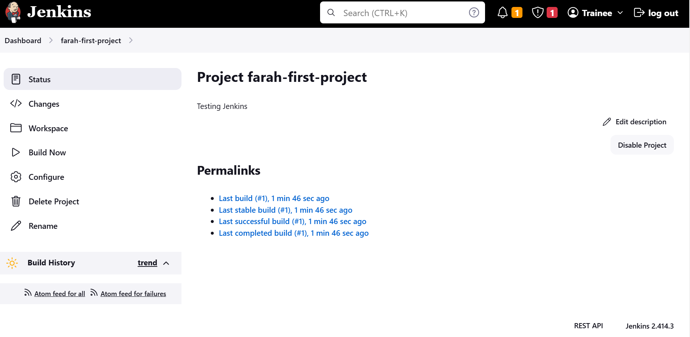

- we know a job is successful because there will be a **green tick next to the build number
- shows detail of the command we ran:
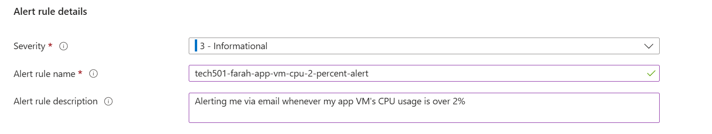
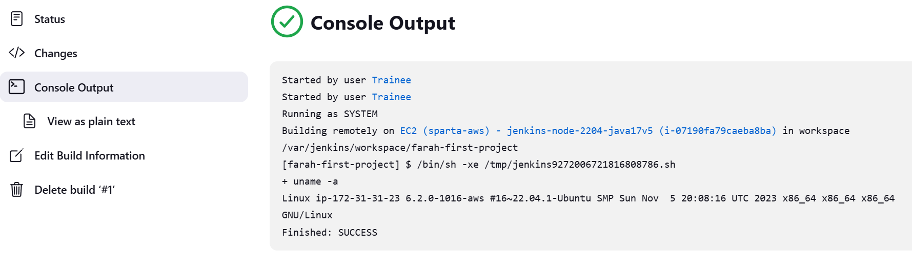
- if need to edit a pipeline, choose Congifure from lefthand menu of the job

- multiple stage pipelines: we can link projects/jobs together to create a multi-stage pipeline
1. on first project job, go to configure
2. add post-build action at end of general tab > build other projects > choose farah-get-date > keep on **Trigger only if build is stable** to run only if first build step(s) are successful
3. Save
4. Build now on first project

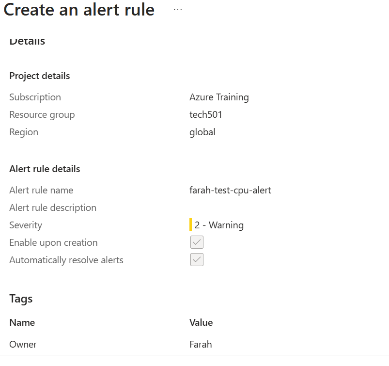
- both jobs have two builds now, showing that the first job did run with a post-build action of running the second job 

Detail on second job, showing its upstream project and console output
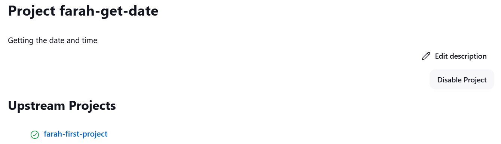
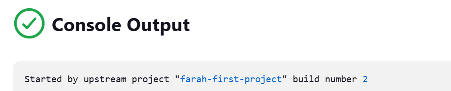

## Create a general diagram of CICD

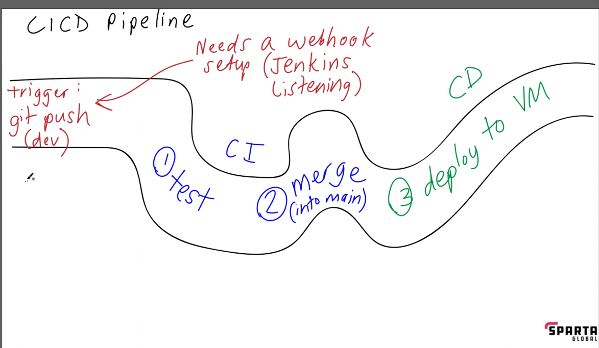

### Wednesday afternoon tasks

1. Redeploy app in 2-tier architecture on AWS for testing
   1. store keypair on AWS
   2. see task card for details on VM size, VNet (default VPC) 
   3. manually redeploy DB VM using code in our scripts
   4. note region: ireland
   - no need to tag
   - need to manually redeploy app VM using code from past repos
   1. post link to posts page, and stop VM
   2. aim to get everything working and document everything to post by 3:30

1. Creating db vm on aws:
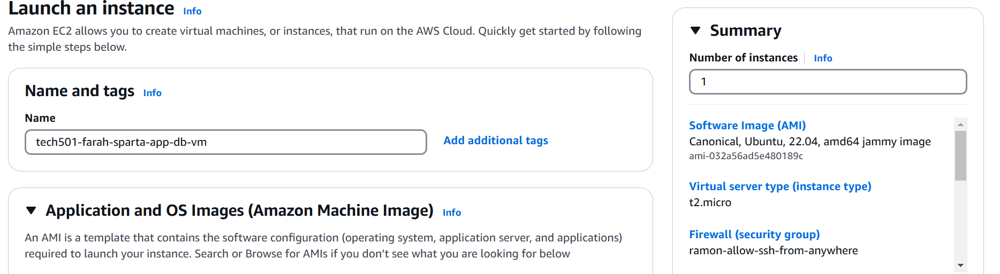
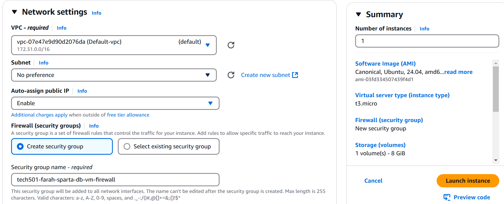
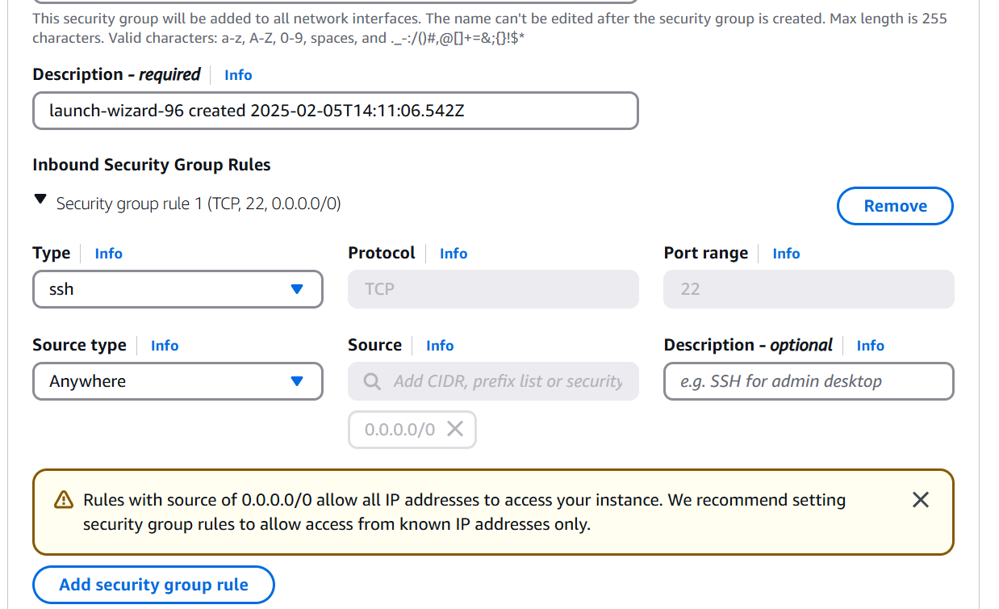

2. Creating app VM is the same; except add HTTP and a custom TCP rule on port 3000

