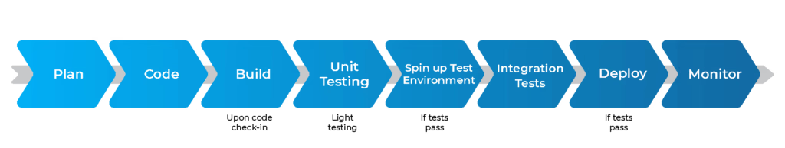
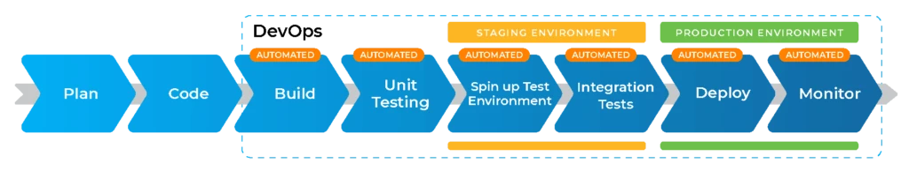

# CI/CD

- [CI/CD](#cicd)
  - [Development lifecycles](#development-lifecycles)
  - [CI and its benefits](#ci-and-its-benefits)
  - [CD and its benefits](#cd-and-its-benefits)
  - [The difference between CD and CDE](#the-difference-between-cd-and-cde)
  - [Jenkins](#jenkins)
    - [Why use Jenkins?](#why-use-jenkins)
    - [Benefits \& disadvantages of using Jenkins](#benefits--disadvantages-of-using-jenkins)
    - [Stages of Jenkins](#stages-of-jenkins)
    - [Alternatives to Jenkins](#alternatives-to-jenkins)
  - [Why build a pipeline? What is its business value?](#why-build-a-pipeline-what-is-its-business-value)
  - [Create a general diagram of CICD](#create-a-general-diagram-of-cicd)
  - [Understand SDLC workflow: plan, design, develop, deploy](#understand-sdlc-workflow-plan-design-develop-deploy)

## Development lifecycles

**Usual lifecycle:**

**In DevOps:**

- remember that the goal of DevOps is to shorten the development lifecycle while maintaining quality and security
- the goal is to get things into production quicker, so automation is used in all stages beyond planning and coding
- **iteration** is also a key principle 

## CI and its benefits

- **Continuous integration**: a software development practice that automates the frequent (e.g. multiple times a day) integration of (naturally small) code changes by multiple developers into one central repository as well as automates its testing
- **Steps**:
  1. Integration involves frequent, small commits to version control systems like Git
  2. a CI service would then immediately build and run unit tests on the code changes to identify errors straight away and give developers feedback
- CI addresses the issues of big code change merges being time-consuming, difficult, and buggy, ultimately meaning users had to wait longer to get the software 
- CI involves the automation of the integration process as well as cultural shift to small, frequent integrations
- **Benefits**:
  - finds and addresses bugs quicker/earlier
  - this ultimately improves software quality
  - and reduces the time it takes to get software out
  - less of a big shift for users because changes happen incrementally

## CD and its benefits

- **Continuous delivery**: a software development practice in which code changes integrated via CI are deployed to a tasting environment for automated testing
- in CD, the tests go beyond the tests run in CI stage -- examples here:
  - UI testing
  - load testing
  - API reliability testing
- **Benefits**:
  - developers can uncover issues quicker
  - delivery is therefore quicker
  - 

## The difference between CD and CDE

- **Continuous deployment**: 

## Jenkins

- **Jenkins**: open-source automation server used by DevOps teams for CI processes
- it manages and controls...

### Why use Jenkins?

### Benefits & disadvantages of using Jenkins

### Stages of Jenkins

### Alternatives to Jenkins

- GitLab (paid)
- Spinnaker (free)
- CircleCI (paid)

## Why build a pipeline? What is its business value?

- 

- CI/CD pipeline will be triggered as soon as changes are pushed to repo
  - this means changes will be tested, then merged, then deployed onto an instance automatically

## Create a general diagram of CICD
## Understand SDLC workflow: plan, design, develop, deploy