# SSHing into GitHub

- [SSHing into GitHub](#sshing-into-github)
  - [High-level steps of Tuesday tasks](#high-level-steps-of-tuesday-tasks)
  - [Generating SSH key-pair](#generating-ssh-key-pair)
  - [Registering public key on GitHub](#registering-public-key-on-github)
  - [Registering the private key on our local machine](#registering-the-private-key-on-our-local-machine)
  - [Creating test repo](#creating-test-repo)
  - [To test connection manually](#to-test-connection-manually)
  - [First Tuesday afternoon task](#first-tuesday-afternoon-task)
  - [Second Tuesday afternoon task](#second-tuesday-afternoon-task)

## High-level steps of Tuesday tasks

1. Generate SSH keypair using RSA
2. Register public key (essentially the padlock) on GitHub
3. Register the private key (essentially the padlock's key) on our local machine
4. Create SSH repo on GitHub to test SSH connection
5. Push changes to SSH repo

- In the past, we have been authenticating our local machine and GitHub via HTTPS in order to push commits
- Now, we will generate a new SSH key-pair to SSH into GitHub from our local machine
- why?

## Generating SSH key-pair

- We want to create a new SSH key-pair because it's more secure to use a different key for different resources
- Using the SSH protocol, we can connect and authenticate to remote servers and services like GitHub without giving our username and personal access token each time
- Steps:
  1. Navigate into ~/.ssh folder
  2. Run `ssh-keygen -t rsa -b 4096 -C "fcheded@gmail.com"`
  3. When prompted, name the SSH key-pair files: *farah-github-key*
  4. Don't enter a pass phrase (i.e. just press *enter* key)

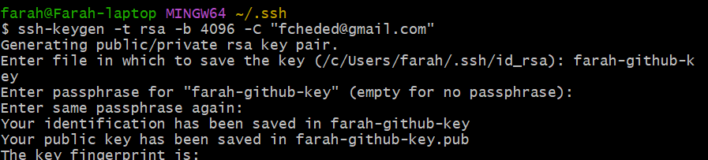

## Registering public key on GitHub

- We're going to give our public key to GitHub
- Remember that we keep the **private key contents** private because there is a command that can be run to work out the public key contents from them (and thus have access to our entire key-pair); however, you can't reverse engineer this with a public key's contents, which is why it's okay to share the public key's contents
1. On GitHub, **Settings** > **SSH & GPG keys**
2. Create **New SSH key**
3. **Title**: *farah-github-key*
4. **Key type**: keep on **Authentication key**
5. Paste **contents of public key** (i.e. *.pub* file) into **Key** box and click **Add**

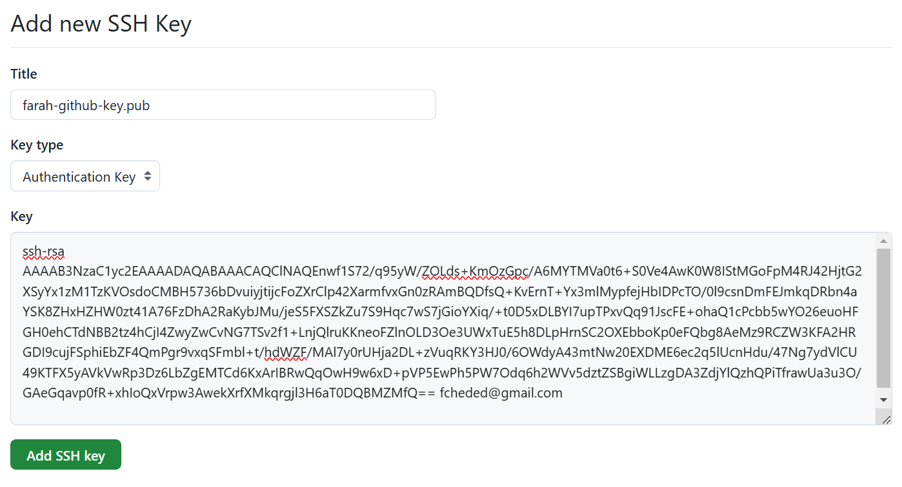

## Registering the private key on our local machine

- It's mportant to get this command right as it can mess things up
- We will use an `ssh-agent` command to register our private key on our local machine
- Steps:
    1. <code>eval \`ssh-agent -s`</code> -- this will print a process ID
    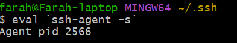
    2. then we need to use `ssh-add` to give ssh-agent our private key name:
       - `ssh-add [private key name]`
       - **result**:
        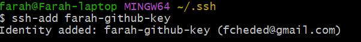
    3. then `ssh -T git@github.com` to SSH into GitHub
       - result (after typing *yes* if it's our first time connecting to GitHub via SSH):
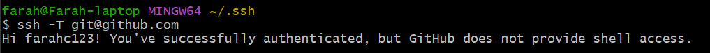

## Creating test repo

- On GitHub:
  - Create **New repo**:
    - **Name**: *tech501-ssh*
    - Keep on **Public**, don't change any other settings
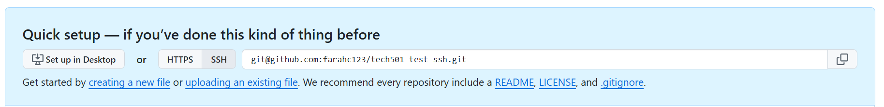
- Note that our SSH address for this repo is  `git@github.com:farahc123/tech501-ssh.git`

## To test connection manually
  1. On a Git Bash window, run `mkdir tech501-ssh` to create a local repo in my local GitHub folder
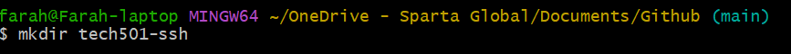
  2. `cd` into this folder
  3. `git init` -- initialises Git repo in this folder
  4. `echo "# tech501-ssh" >> README.md` -- creates README.md file in this repo with the text in quotes as the file contents
  5. `git branch -M main` -- renames current branch to *main*
  6. `git remote add origin git@github.com:farahc123/tech501-ssh.git` -- adds the origin using the SSH address (NOT the HTTPS option) found on GitHub 
  7. `git add .` -- adds files to staging
  8. `git commit -m message "first commit"` -- commits
  9.  `git push -u origin main` -- pushes
- note that if I want to start using HTTPS here again, there are several ways to switch back from SSH (research them)

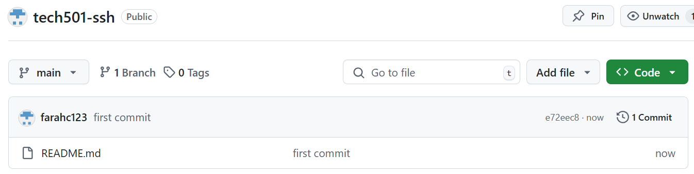

## First Tuesday afternoon task
- Delete repo on local machine
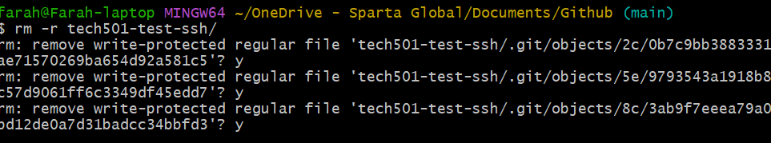
- Delete repo on GitHub
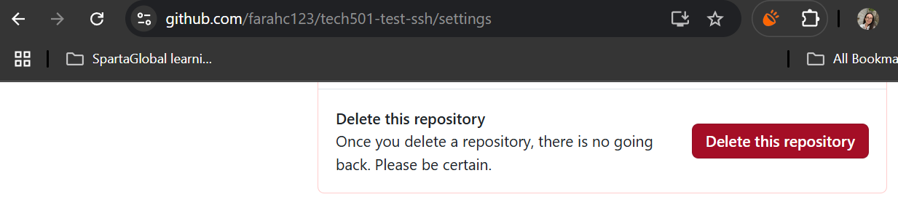
- Delete SSH key on local machine
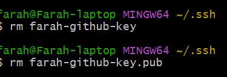
- Delete stored SSH key on GitHub
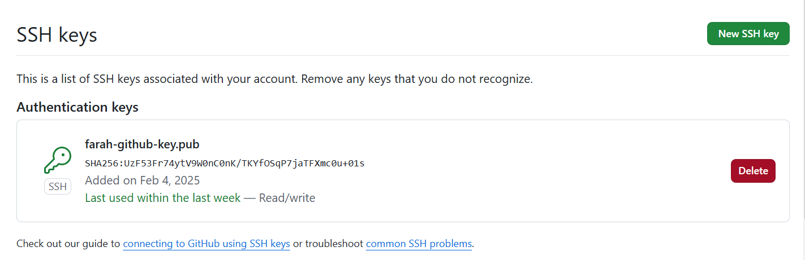
- Remake everything (done; see above)

## Second Tuesday afternoon task
- complete alert task
- document (INCLUDE SCREENSHOT OF NOTIFICATION EMAIL PROVING I MANAGED TO TRIGGER AN ALERT AND GOT AN EMAIL) -- SET THRESHOLD LOW FOR THIS
- submit docs by EOD
- delete vnet, machines, action group, dashboard (newly created for this vm)