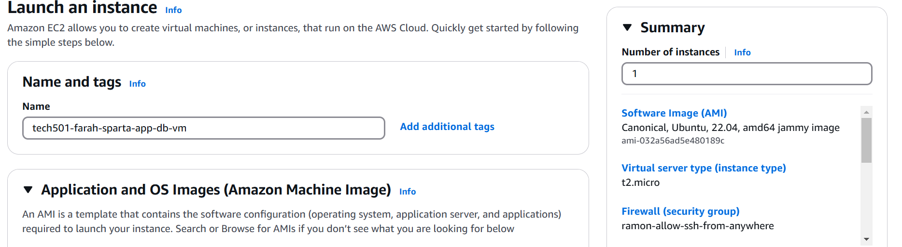
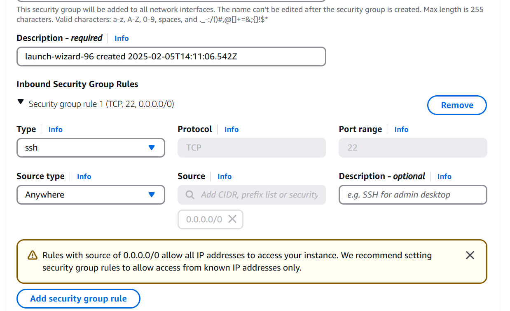
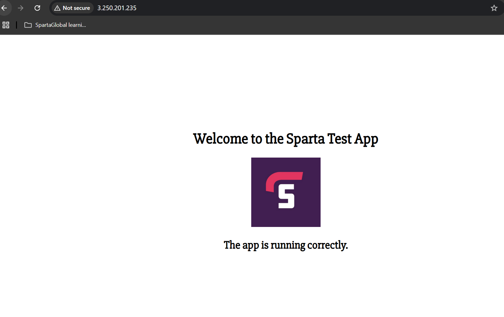

# Steps to deploy 2-tier architecture in AWS

1. Create DB app instance (i.e. VM) -- the optiosn here are different to Azure:
   - name
   - Ubuntu 22.04 LTS
   - t3.micro
   - create keypair: AWS will give the private key contents; download and securely store; use a bash command to work out the public key and store this too
   - Use default network (VPC) and subnet
   - Create security group, allowing SSH from anywhere for testing purpose
 2. Connect via SSH (this looks a little different on Azure) and provision app VM:
    1. update and upgrade packages
    2. install gnupg curl, which we will use to download  gpg key
    3. create file list
    4. updates
    5. installs mongodb
    6. manually configure bindip in /etc/mongod.conf from localhost to 0.0.0.0 so it accepts connections from anywhere
    7. enable mongod
    8. check it's enabled
    9. start mongod
    10. restart mongod

  

3. Create app VM:
   - Same as above, except add an inbound HTTP rule to the NSG as well as a custom TCP rule on port 3000

4. Connect to app VM via SSH and provision it:

    1. Update package list and install them:
    `sudo apt update && sudo apt upgrade -y`
 
    2. Install nginx and verify status:
`sudo apt install nginx -y`
`sudo systemctl status nginx`

    3. Enabling and starting nginx
`sudo systemctl enable nginx`
`sudo systemctl start nginx`
 
    4. Installing *npm* and *nodejs*
`sudo DEBIAN_FRONTEND=noninteractive bash -c "curl -fsSL https://deb.nodesource.com/setup_20.x | bash -"`
`sudo DEBIAN_FRONTEND=noninteractive apt-get install -y nodejs` 
     - veryifying their installation: `node -v` `npm -v`
 
 
    5. Navigate to /, and clone the nodejs app repo (using Sameem's for now while I figure out issues with mine)
`git clone https://github.com/sameem97/tech501-sparta-app.git`
        - enter the app folder, run `npm install` to install the package to the app
        - Check app is working with `npm start` from within the app folder and visiting the public IP of the app VM with *:3000*
   
    6. Creating a backup of nginx configuration file:
`cd /etc/nginx/sites-available/`
`cp default default.backup` 

    7. Editing nginx configuration file to apply reverse proxy
`sudo nano /etc/nginx/sites-available/default`

- Removing *try_files* line  and replacing with (ensure bracket remains closed on next line):

`proxy_pass http://localhost:3000;`

    8. Checking if *nginx* config file syntax is okay:

`sudo nginx -t`

    9. Reloading *nginx* to put above config file edit into action

`sudo systemctl reload nginx`
 
    10. Check app is working on app VM's public IP url
   
1. Connecting the VMs together:

   1. On the app VM, navigate into the app folder and run: 
`export DB_HOST=mongodb://<db_private_ip>:27017/posts`

   2. Start the node app in backround with npm:
`npm start app`

   3. Visit the */posts* page 

- Proof of app front page working with reverse proxy: 

To do:
- set up database connection and validate